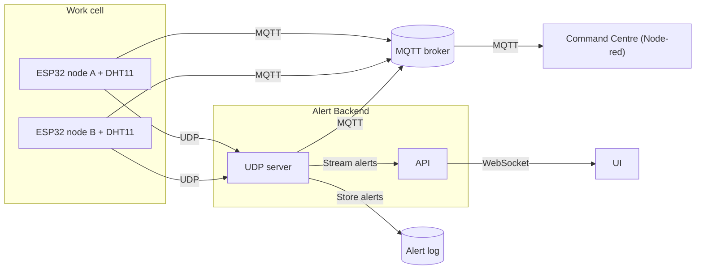

# Design

## Component architecture

```mermaid
flowchart LR
    subgraph Cell["Work cell"]
        A["ESP32 node A + DHT11"]
        B["ESP32 node B + DHT11"]
    end

    BROKER[("MQTT broker")]
    LOG[("Alert log")]

    subgraph Backend["Alert Backend"]
        UDP["UDP server"]
        WS["API"]
    end

    NR["Command Centre (Node-red)"]
    UI["UI"]

    A -- "MQTT" --> BROKER
    B -- "MQTT" --> BROKER
    A -- "UDP" --> UDP
    B -- "UDP" --> UDP

    UDP -- "Store alerts" --> LOG
    UDP -- "Stream alerts" --> WS
    UDP -- "MQTT" --> BROKER
    BROKER -- "MQTT" --> NR
    WS -- "WebSocket" --> UI
```